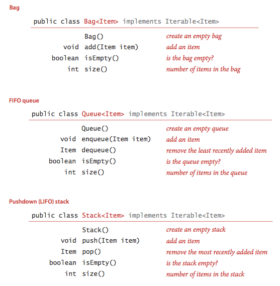

# 1.1   Programming Model

**Recursion:** A recursive method is a method that calls itself either directly or indirectly. There are three important rules of thumb in developing recursive programs: 
- The recursion has a base case. 
- Recursive call must address subproblems that are smaller in some sense, so that recursive calls converge to the base case. 
- Recursive calls should not address subproblems that overlap.

**Basic programming model:**  A library of static methods is a set of static methods that are defined in a Java class. A basic model for Java programming is to develop a program that addresses a specific computational task by creating a library of static methods, one of which is named main(). 

## Binary search 
Binary search. Below is a complete Java program BinarySearch.java that illustrates many of the basic features of our programming model. It implement a classic algorithm known as binary search and tests it for an application known as allowlist filtering. 
```

BinarySearch.java


Below is the syntax highlighted version of BinarySearch.java from §1.1 Programming Model.


/******************************************************************************
 *  Compilation:  javac BinarySearch.java
 *  Execution:    java BinarySearch allowlist.txt < input.txt
 *  Dependencies: In.java StdIn.java StdOut.java
 *  Data files:   https://algs4.cs.princeton.edu/11model/tinyAllowlist.txt
 *                https://algs4.cs.princeton.edu/11model/tinyText.txt
 *                https://algs4.cs.princeton.edu/11model/largeAllowlist.txt
 *                https://algs4.cs.princeton.edu/11model/largeText.txt
 *
 *  % java BinarySearch tinyAllowlist.txt < tinyText.txt
 *  50
 *  99
 *  13
 *
 *  % java BinarySearch largeAllowlist.txt < largeText.txt | more
 *  499569
 *  984875
 *  295754
 *  207807
 *  140925
 *  161828
 *  [367,966 total values]
 *
 ******************************************************************************/

import java.util.Arrays;

/**
 *  The {@code BinarySearch} class provides a static method for binary
 *  searching for an integer in a sorted array of integers.
 *  <p>
 *  The <em>indexOf</em> operations takes logarithmic time in the worst case.
 *  <p>
 *  For additional documentation, see <a href="https://algs4.cs.princeton.edu/11model">Section 1.1</a> of
 *  <i>Algorithms, 4th Edition</i> by Robert Sedgewick and Kevin Wayne.
 *
 *  @author Robert Sedgewick
 *  @author Kevin Wayne
 */
public class BinarySearch {

    /**
     * This class should not be instantiated.
     */
    private BinarySearch() { }

    /**
     * Returns the index of the specified key in the specified array.
     *
     * @param  a the array of integers, must be sorted in ascending order
     * @param  key the search key
     * @return index of key in array {@code a} if present; {@code -1} otherwise
     */
    public static int indexOf(int[] a, int key) {
        int lo = 0;
        int hi = a.length - 1;
        while (lo <= hi) {
            // Key is in a[lo..hi] or not present.
            int mid = lo + (hi - lo) / 2;
            if      (key < a[mid]) hi = mid - 1;
            else if (key > a[mid]) lo = mid + 1;
            else return mid;
        }
        return -1;
    }

    /**
     * Returns the index of the specified key in the specified array.
     * This function is poorly named because it does not give the <em>rank</em>
     * if the array has duplicate keys or if the key is not in the array.
     *
     * @param  key the search key
     * @param  a the array of integers, must be sorted in ascending order
     * @return index of key in array {@code a} if present; {@code -1} otherwise
     * @deprecated Replaced by {@link #indexOf(int[], int)}.
     */
    @Deprecated
    public static int rank(int key, int[] a) {
        return indexOf(a, key);
    }

    /**
     * Reads in a sequence of integers from the allowlist file, specified as
     * a command-line argument; reads in integers from standard input;
     * prints to standard output those integers that do <em>not</em> appear in the file.
     *
     * @param args the command-line arguments
     */
    public static void main(String[] args) {

        // read the integers from a file
        In in = new In(args[0]);
        int[] allowlist = in.readAllInts();

        // sort the array
        Arrays.sort(allowlist);

        // read integer key from standard input; print if not in allowlist
        while (!StdIn.isEmpty()) {
            int key = StdIn.readInt();
            if (BinarySearch.indexOf(allowlist, key) == -1)
                StdOut.println(key);
        }
    }
}


Copyright © 2000–2019, Robert Sedgewick and Kevin Wayne.
Last updated: Thu Aug 11 07:59:46 EDT 2022.

```
- The static method rank() takes an integer key and a sorted array of int values as arguments and returns the index of the key if it is present in the array, -1 otherwise.
- It accomplishes this task by maintaining variables lo and hi such that the key is in a[lo..hi] if it is in the array, then entering into a loop that tests the middle entry in the interval (at index mid).
- If the key is equal to a[mid], the return value is mid; otherwise the method cuts the interval size about in half, looking at the left half if the key is less than a[mid] and at the right half if the key is greater than a[mid].
- The process terminates when the key is found or the interval is empty. 

### Exercises: 
- Sattolo's algorithm | Sattolo.java
- Wget | Wget.java
- Right triangle | RightTrinagle.java 
- Bouncing ball | BounchingBall.java 

# 1.2 Data Abstraction 

## Object-oriented programming: 

***Programming in Java is largely based on building data types.*** ***This style of programming is known as object-oriented programming***, as it revolves around the concept of an object, an entity that holds a data type value.

- **Data types.** A data type is a set of values and a set of operations on those values. 

- **Abstract data types.** An abstract data type is a data type whose internal representation is hidden from the client. 

- **Objects.** An object is an entity that can take on a data-type value. Objects are characterized by three essential properties:      
  - The state of an object is a value from its data type; 
  - the identity of an object distinguishes one object from another; 
  - the behavior of an object is the effect of data-type operations. 
  - In Java, a reference is a mechanism for accessing an object. 
- **Applications programming interface (API).** To specify the behavior of an abstract data type, we use an application programming interface (API), which is a list of constructors and instance methods (operations), with an informal description of the effect of each.
- **Client.** A client is a program that uses a data type. 
- **Implementation.** An implementation is the code that implements the data type specified in an API. 
- **Creating objects.** Each data-type value is stored in an object. To create (or instantiate) an individual object, we invoke a constructor by using the keyword new. Each time that a client uses new, the system allocates memory space for the object, initializes its value, and returns a reference to the object. 

### Examples of abstract data types.
- Geometric objects. A natural example of object-oriented programming is designing data types for geometric objects. 
- Information processing. Abstract data types provide a natural mechanism for organizing and processing information. the information 
- **Strings.** Java's String data type in an important and useful ADT. A String is an indexed sequence of char values. String has dozens of instance methods.

### Implementing abstract data types.
**We implement ADTs with a Java class**, putting the code in a file with the same name as the class, followed by the .java extension. The first statements in the file declare instance variables that define the data-type values. Following the instance variables are the constructor and the instance methods that implement operations on data-type values. 

- Instance variables.To define data-type values (**the state of each object**), we declare instance variables in much the same way as we declare local variables, **we use private, using a Java language mechanism to enforce the idea that the representation of an ADT is to be hidden from the client, and also final, if the value is not to be changed once it is initialized.** 
- Constructors. The constructor **establishes an object's identity and initializes the instance variables.**
- Instance methods. **Instance methods specify the data-type operations.** Instance methods may be public (specified in the API) or private (used to organize the computation and not available to clients). 
- Scope. Instance methods use three kinds of variables: **parameter variables, local variables, and instance variables.**


### Designing abstract data types.

- **Encapsulation.** ***A hallmark of object-oriented programming is that it enables us to encapsulate data types within their implementations***, to facilitate separate development of clients and data type implementations. ***Encapsulation enables modular programming.*** 

- **Designing APIs.** ***One of the most important and most challenging steps in building modern software is designing APIs.*** ***Ideally, an API would clearly articulate behavior for all possible inputs***, ***including side effects***, and then we would have ***software to check that implementations meet the specification***. Unfortunately, a fundamental result from theoretical computer science known as the ***specification problem*** implies that this goal is actually impossible to achieve. There are numerous potential pitfalls when designing an API: 
  - Too hard to implement, making it difficult or impossible to develop.
  - Too hard to use, leading to complicated client code. 
  - Too narrow, omitting methods that clients need. 
  - Too wide, including a large number of methods not needed by any client. 
  - Too general, providing no useful abstractions. 
  - Too specific, providing an abstraction so diffuse as to be useless.
  - Too dependent on a particular representation, therefore not freeing client code from the details of the representation. 
  - (**In summary, provide to clients the methods they need and no others.**)

- **Algorithms and ADTs.** Data abstraction is naturally suited to the study of algorithms, because it helps us provide a framework within which we can precisely specify both what an algorithm needs to accomplish and how a client can make use of an algorithm. 

- **Interface inheritance.** Java provides language support for defining **relationships among objects, known as inheritance.** The first inheritance mechanism that we consider is known as ***subtyping***, which **allows us to specify a relationship between otherwise unrelated classes by specifying in an interface a set of common methods that each implementing class must contain.**  

- **Implementation inheritance.** Java also supports another inheritance mechanism known as ***subclassing***, which is a powerful technique that enables a programmer to **change behavior and add functionality without rewriting an entire class from scratch. The idea is to define a new class (subclass) that inherits instance methods and instance variables from another class (superclass).** We avoid subclassing in this book because it generally works against encapsulation. Certain vestiges of the approach are built in to Java and therefore unavoidable: specifically, **every class is a subclass of Object.**
  -  Class Object is the root of the class hierarchy. Every class has Object as a superclass. All objects, including arrays, implement the methods of this class. 

- **String conversion.** Every Java type inherits toString() from Object. This convention is the basis for Java's automatic conversion of one operand of the concatenation operator + to a String whenever the other operand is a String.

- **Memory management.** One of Java's most significant features is its ability to automatically manage memory. When an object can no longer be referenced, it is said to be orphaned. Java keeps track of **orphaned objects** and returning the memory they use to a pool of free memory. Reclaiming memory in this way is known as **garbage collection.**

- **Immutability**. An immutable data type has the property that the value of an object never changes once constructed. By contrast, a mutable data type manipulates object values that are intended to change. Java's language support for helping to enforce immutability is the **final** modifier. When you declare a variable to be final, you are promising to assign it a value only once, either in an initializer or in the constructor. Code that could modify the value of a final variable leads to a compile-time error. 

- Exceptions and errors are disruptive events that handle unforeseen errors outside our control.
  - `throw new RuntimeException("Error message here.");` create your own exceptions.

### Exercises: 

1. Write a Point2D.java client that takes an integer value N from the command line, generates N random points in the unit square, and computes the distance separating the closest pair of points. 

2. Using our implementation of Date.java as a model, develop an implementation of Transaction.java. 

3. Using our implementation of equals() in Date.java as a model, develop an implementation of equals() for Transaction.java. 

(Creative Problems)

4. Rational numbers. Implement an immutable data type Rational.java for rational numbers that supports addition, subtraction, multiplication, and division. 

5. Sample variance for accumulator. Validate that the following code, which adds the methods var() and stddev() to Accumulator.java to compute the mean, sample variance, and sample standard deviation of the numbers presented as arguments to addDataValue(). 

6. Parsing. Develop the parse constructors for your Date.java and Transaction.java implementations that take a single String argument to specify the initialization values, using the formats given in the table below. 

# 1.3 Bags, Queues, and stacks. 

**Several fundamental data types involve collections of objects.**

Specifically, the set of values is a collection of objects, and the operations revolve around adding, removing, or examining objects in the collection.

In this section, we consider three such data types, known as the bag, the queue, and the stack. They differ in the specification of which object is to be removed or examined next. 

We define the APIs for bags, queues, and stacks. Beyond the basics, these APIs reflect two Java features: **generics and iterable collections.**



**Generics:**

- They were designed to extend Java's type system to allow "a type or method to operate on objects of various types while providing compile-time type safety"

-  An essential characteristic of **collection ADTs** is that **we should be able to use them for any type of data.** A specific **Java mechanism known as generics enables this capability.** 

The notation <Item> after the class name in each of our APIs defines the name Item as a type parameter, a symbolic placeholder for some concrete type to be used by the client.

You can read Stack<Item> as "stack of items." For example, you can write code such as:
```
Stack<String> stack = new Stack<String>();
stack.push("Test");
...
String next = stack.pop(); 
```

**Autoboxing:** 

**Type parameters have to be instantiated as reference types**

**so Java automatically converts** between a **primitive type and its corresponding wrapper type in assignments, method arguments, and arithmetic/logic expressions.**

**This conversion enables us to use generics with primitive types**, as in the following code: 
```
Stack<Integer> stack = new Stack<Integer>();
stack.push(17);        // autoboxing (int -> Integer)
int i = stack.pop();   // unboxing   (Integer -> int)
```
( Automatically casting a **primitive type to a wrapper type is known as autoboxing**, and automatically **casting a wrapper type to a primitive type is known as unboxing.** )

Iterable collections.

For many applications, the client's requirement is just to process each of the items in some way, or to iterate through the items in the collection. Java's foreach statement supports this paradigm. For example, suppose that collection is a Queue<Transaction>. Then, if the collection is iterable, the client can print a transaction list with a single statement: 

```
for (Transaction t : collection)
   StdOut.println(t);
```

**Bags.** 

A bag is a **collection where removing items is not supported**—its purpose is to provide clients with the ability to **collect items and then to iterate through the collected items.** 

**FIFO queues.**

A FIFO queue is a collection that is based on the first-in-first-out (FIFO) policy. The policy of doing tasks in the same order that they arrive is one that we encounter frequently in everyday life: from people waiting in line at a theater, to cars waiting in line at a toll booth, to tasks waiting to be serviced by an application on your computer. 

**Pushdown stack.**

A pushdown stack is a collection that is based on the last-in-first-out (LIFO) policy. When you click a hyperlink, your browser displays the new page (and pushes onto a stack). You can keep clicking on hyperlinks to visit new pages, but you can always revisit the previous page by clicking the back button (popping it from the stack).

## Linked lists.

A linked list is a recursive data structure that is either empty (null) or a reference to a node having a generic item and a reference to a linked list. To implement a linked list, we start with a nested class that defines the node abstraction. 
```
private class Node {
   Item item;
   Node next;
}
```
### Building a linked list. 
To build a linked list that contains the items to, be, and or, we create a **Node** for each item, set the item field in each of the nodes to the desired value, and set the next fields to build the linked list. 

... +
